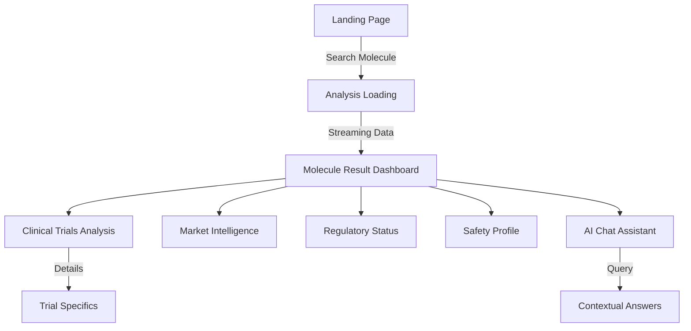
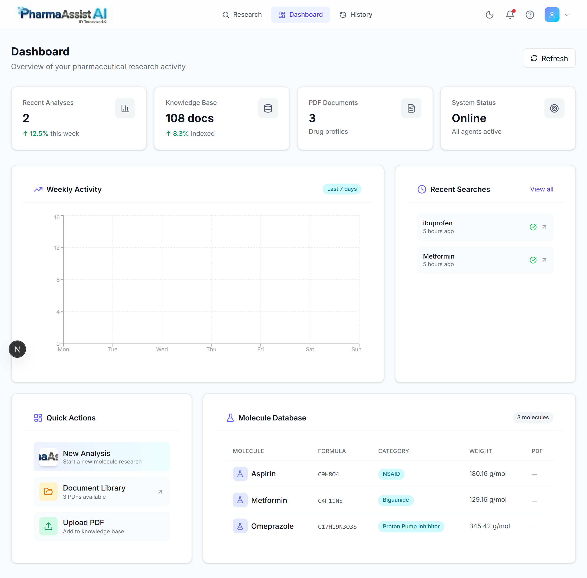
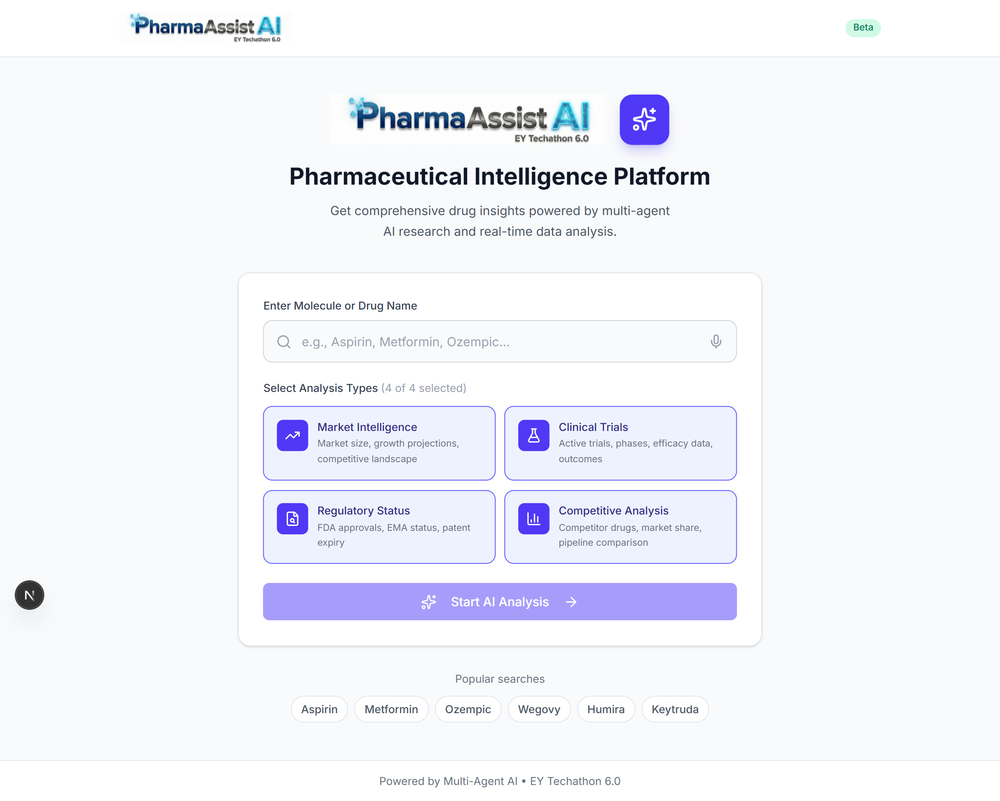
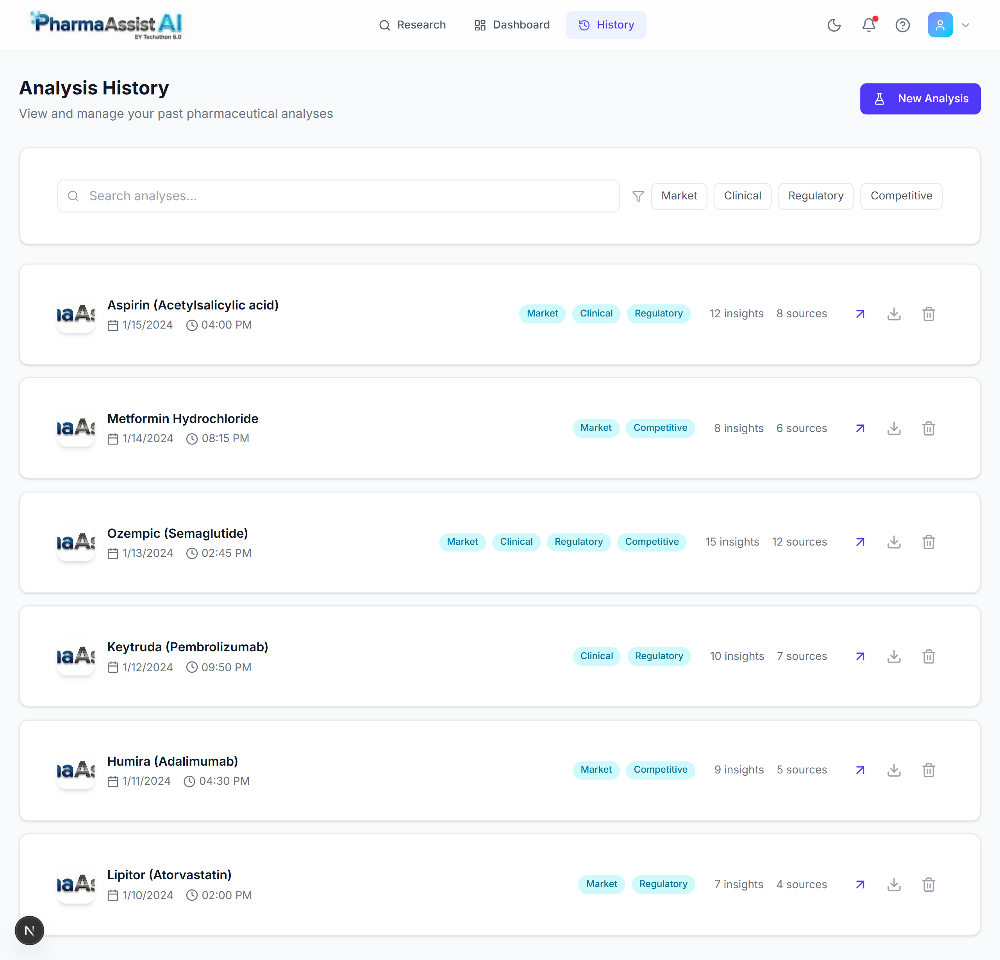
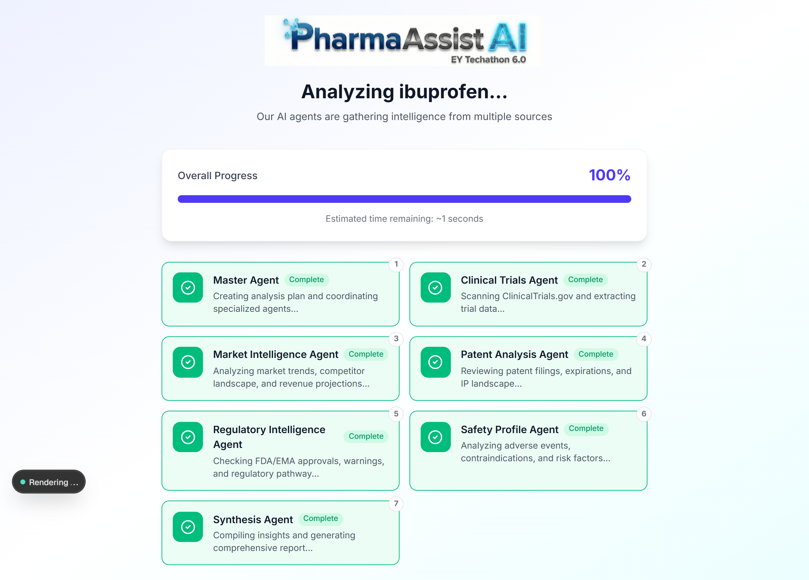
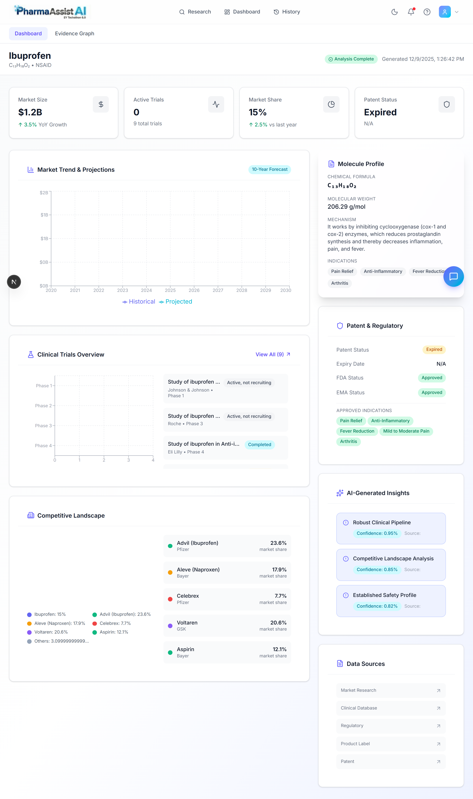
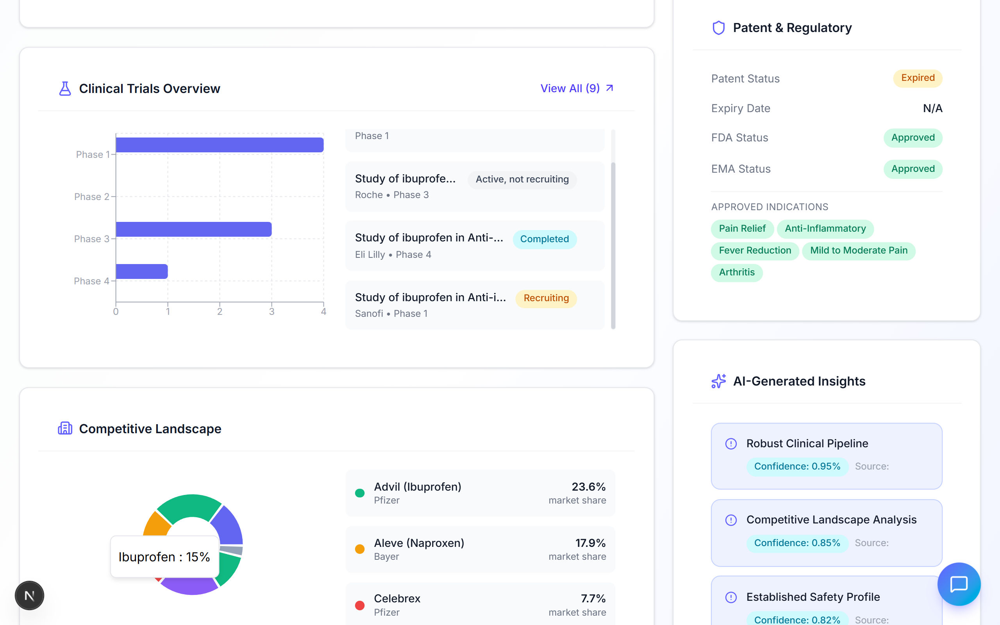
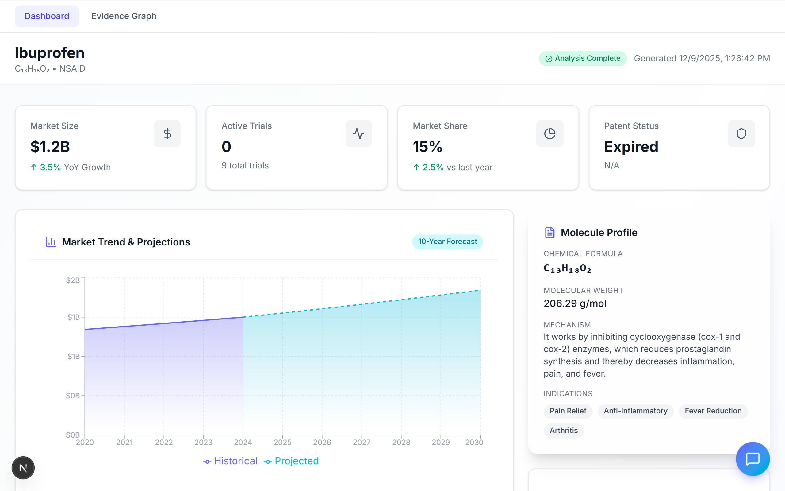
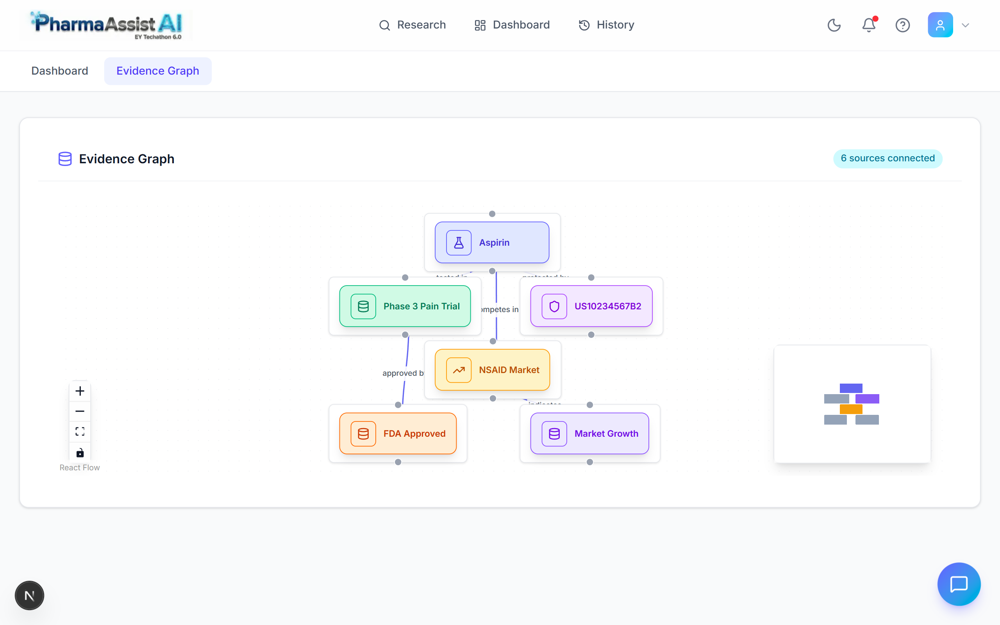
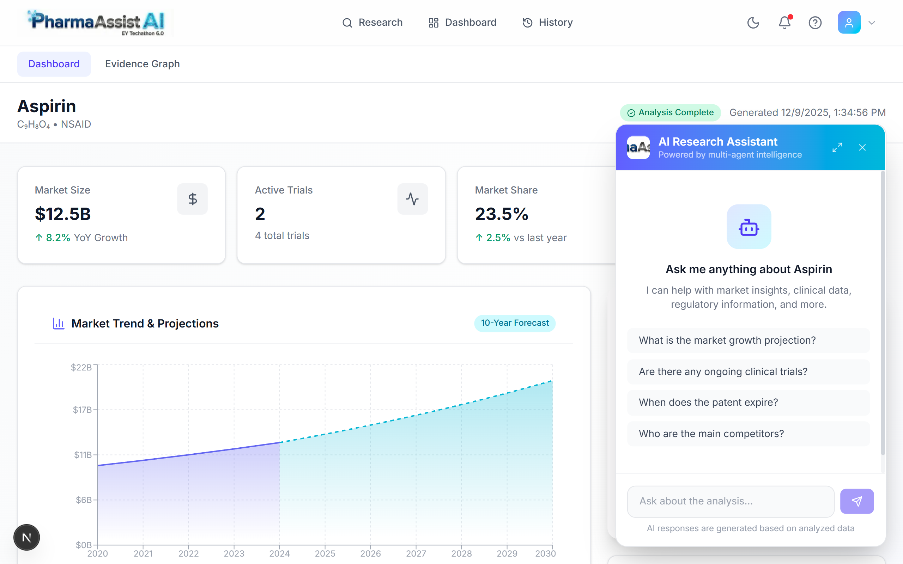

# PharmaAssist AI - Design & Architecture (Round 2)

## 📱 User Experience Flow

The following diagram illustrates the core user journey through the PharmaAssist AI platform, from initial molecule search to deep insight generation.

## 🖥️ Interface Walkthrough

### 1. Global Research Dashboard
The central command center for drug intelligence across all searches.

> **Design Philosophy**: Information density without clutter. Uses a bento-grid layout for high-level metrics (FDA status, Market Cap) while allowing deep dives via tabs.

### 2. Search & Analysis Initiation
The entry point where users define their research target or browse history.

#### History View
Quick access to past analyses with status indicators.

### 3. Multi-Agent Orchestration
Visualizing the AI "thinking" process builds user trust.

> **UX features**: Individual agent cards lighting up as they activate (Brain, Flask, Chart, etc.) providing transparency into the RAG pipeline.

### 4. Molecule Result Page (Deep Dive)
The granular analysis for a specific target molecule.

#### Market Intelligence
Detailed market size, CAGR, and competitor landscape.

#### Clinical Trials
Comprehensive breakdown of trial phases and status.

### 5. Evidence Visualization
Graph-based view of connected entities and data sources.

> **Insight**: Visualizes relationships between molecules, trials, and patents.

### 6. Conversational Intelligence
Turning static data into dynamic answers.

## 🔮 Future Roadmap (Concept Wireframes)
*Proposed features for the next development phase.*

### Comparative Analysis View
*Side-by-side comparison of multiple drugs.*

### Automated PDF Report Generation
*Preview of the exportable executive summary.*
